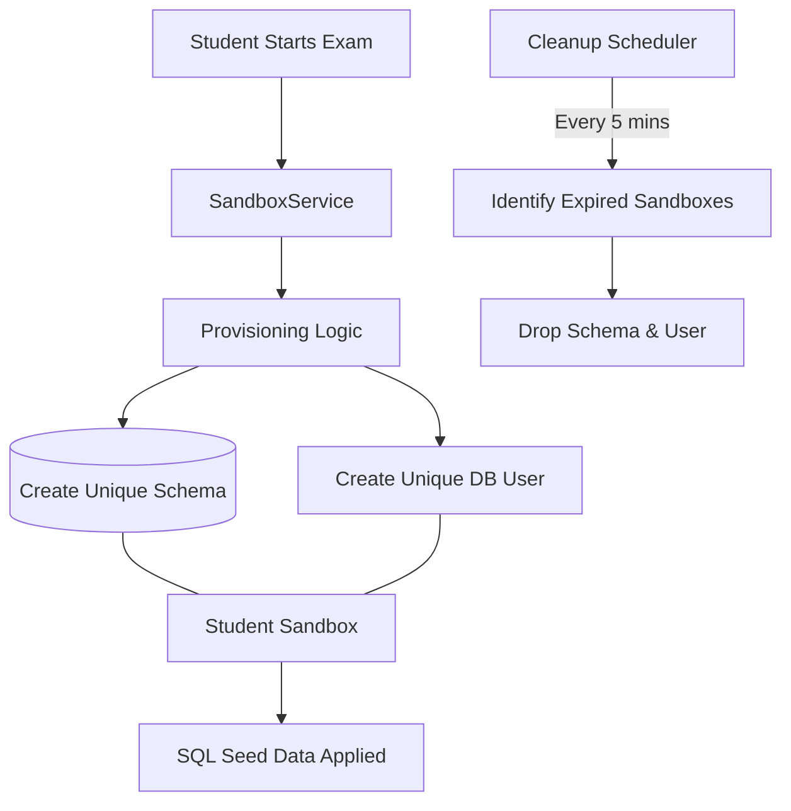

# QueryMe SQL Sandbox Module

The **SQL Sandbox Module** is a core security component of the **QueryMe Platform**, designed to provide a safe and isolated environment where students can execute SQL queries during exams without interfering with each other.

Built on **PostgreSQL**, the module uses **Dynamic Schema Isolation** and **role-based access control** to enforce strict security and prevent unauthorized access.

---

## Why This Module Matters

- Prevents cheating during SQL-based exams  
- Ensures each student works in a completely isolated environment  
- Protects the main database from harmful or incorrect queries  
- Automatically cleans up unused resources to maintain system performance  

---

## Core Architecture Overview

---

## Security & Isolation Model

The module implements a **Defense-in-Depth strategy** using two layers of isolation:

| Isolation Layer | Implementation Detail | Purpose |
| :--- | :--- | :--- |
| **Namespace Isolation** | PostgreSQL Schema | Creates a private workspace for each student (e.g., `exam_<id>_student_<id>`) |
| **Identity Isolation** | Unique DB User | Assigns a dedicated database user with a secure random password |
| **Access Control** | REVOKE / GRANT | Revokes all default privileges on the `public` schema and restricts access strictly to the assigned schema |

---

## ⚙️ Technical Components

### 1. Service Layer (`sandbox.service`)

- **`SandboxService`**  
  Defines core operations:
  - `provisionSandbox()`
  - `teardownSandbox()`
  - `getConnectionInfo()`

- **`SandboxServiceImpl`**  
  Handles execution logic using `JdbcTemplate`:
  - Creates schema (`CREATE SCHEMA`)
  - Creates database user (`CREATE USER`)
  - Assigns permissions (`GRANT`, `REVOKE`)
  - Executes SQL seed scripts to initialize student data

---

### 2. Persistence Layer (`sandbox.model` & `repository`)

- **`SandboxRegistry`**  
  Tracks all sandbox instances and their lifecycle

- **`SandboxRegistryRepo`**  
  Handles queries for active and expired sandboxes  

#### Registry Table: `sandbox_registry`

| Column | Type | Description |
| :--- | :--- | :--- |
| `id` | UUID | Primary Key |
| `schema_name` | String | Unique schema name |
| `exam_id` | UUID | Associated exam |
| `student_id` | UUID | Owner of the sandbox |
| `db_user` | String | Database username |
| `expires_at` | Timestamp | Expiration time for cleanup |
| `status` | String | `ACTIVE` or `DROPPED` |

---

### 3. Background Maintenance (`sandbox.service`)

- **`SandboxCleanupScheduler`**
  - Runs every **5 minutes** (`300000 ms`)
  - Identifies expired sandboxes
  - Automatically drops:
    - Schemas
    - Database users
  - Updates registry status

---

## Usage Flow

1. **Provision Request**  
   The system calls:
   provisionSandbox(examId, studentId, seedSql)

2. **Connection Access**  
   The student receives:
   - Schema name  
   - Database username  
   - Credentials  

3. **Execution Phase**  
   The student executes SQL queries inside their isolated environment

4. **Automatic Cleanup**  
   After the exam session:
   - Scheduler removes schema and user  
   - Resources are freed  

---

## Integration

This module is integrated into the **QueryMe backend system** and is triggered during exam sessions via the **Exam Service**.

It works with:
- Authentication system  
- Exam management module  
- Database layer 